# Backend приложения 

Backend-часть платформы для волонтерства и некоммерческих организаций (НКО), разработанная на FastAPI.

## Документация

После разворачивания документация доступна в виде Swagger доступна по [http://localhost:8000/docs](http://localhost:8000/docs)

Все реализованные endpoint-ы деляться на логические блоки:

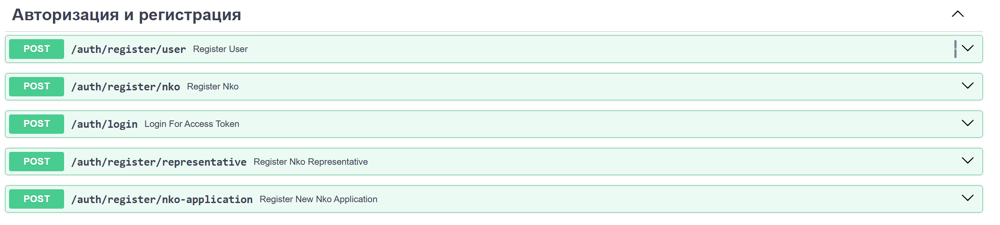

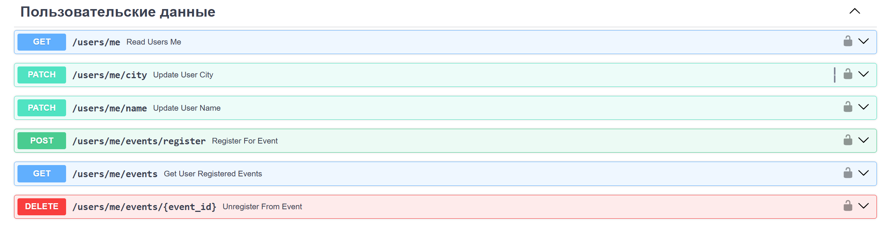

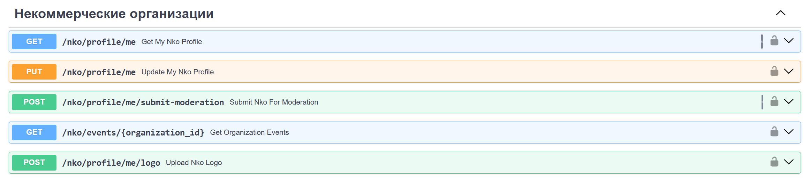

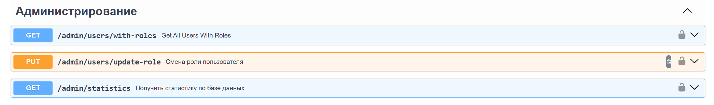

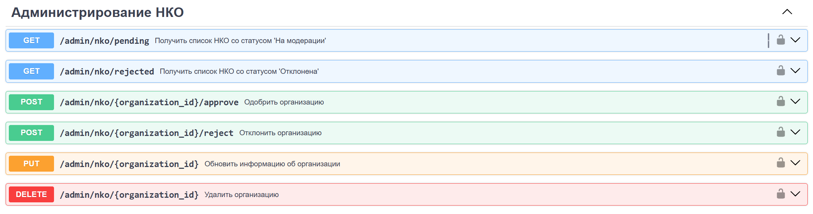

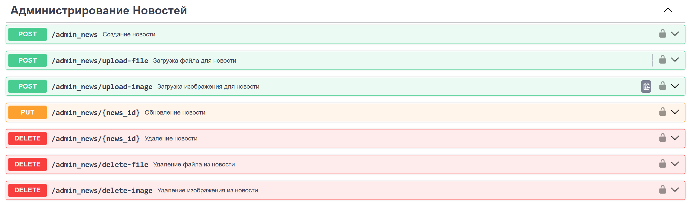

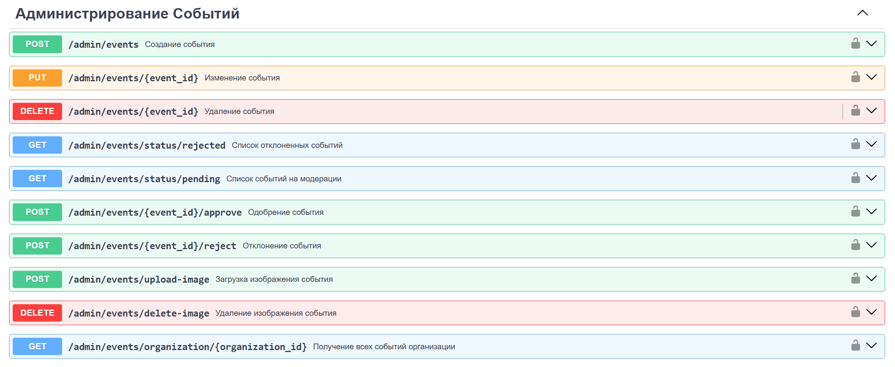

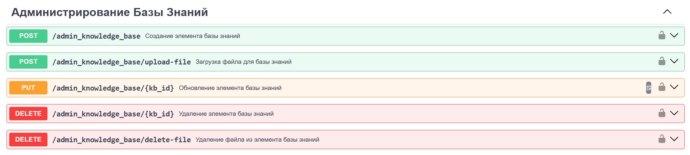

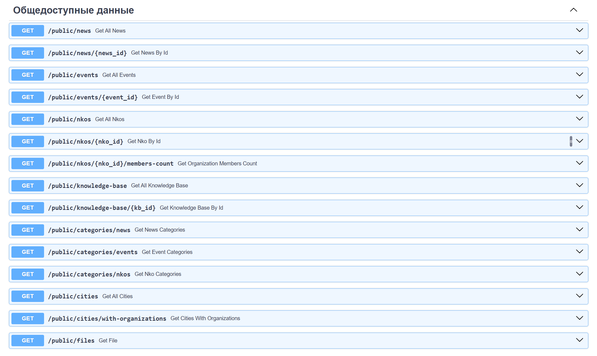

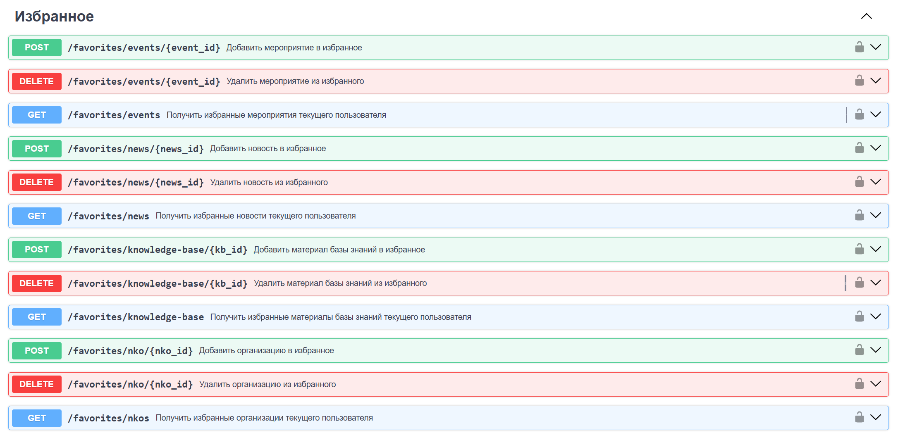

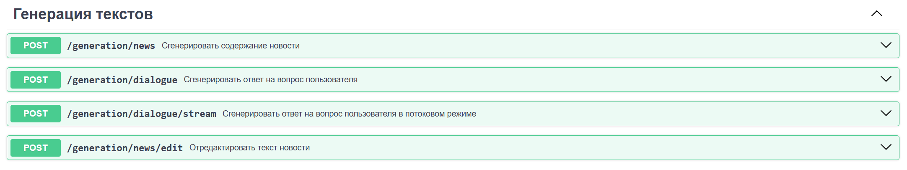


## 🛠 Стек технологий

### Основные технологии
- **FastAPI** — современный веб-фреймворк для создания REST API
- **PostgreSQL** — реляционная база данных
- **SQLAlchemy** — ORM для работы с базой данных
- **Uvicorn** — ASGI-сервер для запуска приложения

### Аутентификация и безопасность
- **python-jose[cryptography]** — работа с JWT токенами
- **passlib[bcrypt]** — хэширование паролей
- **bcrypt** — алгоритм хэширования паролей

### Хранилище файлов
- **MinIO** — объектное хранилище для файлов (изображения, документы, материалы)

### Генерация контента
- **OpenAI API** — интеграция с OpenAI/OpenRouter для генерации текстового контента (новости, описания)

### Дополнительные библиотеки
- **pydantic** — валидация данных и настройки
- **pydantic-settings** — управление настройками из переменных окружения
- **python-multipart** — обработка загрузки файлов
- **psycopg2-binary** — драйвер PostgreSQL
- **alembic** — миграции базы данных
- **pytest** — тестирование
- **requests** — HTTP-запросы

## 🗄 База данных

База данных PostgreSQL содержит следующие основные сущности:

### Основные сущности

#### 1. **User (Пользователь)**
- Основная информация о пользователях системы
- Поля: имя, фамилия, отчество, email, пароль, фото профиля
- Связи: роль, город, организация

#### 2. **Organization (Организация/НКО)**
- Информация о некоммерческих организациях
- Поля: название, краткое название, описание, логотип, обложка, адрес, сайт, телефон, email, год основания
- Связи: категория, город, статус модерации
- Дополнительные таблицы: фото организации, социальные сети

#### 3. **Event (Мероприятие)**
- Информация о волонтерских мероприятиях и событиях
- Поля: название, описание, дата и время проведения, адрес, количество участников, крайний срок регистрации
- Связи: организация-организатор, тип мероприятия, категория, статус
- Дополнительные таблицы: фото, файлы, хештеги

#### 4. **News (Новости)**
- Новостные материалы платформы
- Поля: название, описание, полное описание, дата события
- Связи: категория новостей, город
- Дополнительные таблицы: фото, файлы, хештеги

#### 5. **KnowledgeBaseData (База знаний)**
- Обучающие материалы и ресурсы
- Поля: название, описание, полное описание, количество просмотров, ссылки на видео и материалы
- Связи: категория базы знаний, тип материала
- Дополнительные таблицы: материалы (файлы)

#### 6. **ParticipantEvent (Участник мероприятия)**
- Регистрация пользователей и организаций на мероприятия
- Поля: дата подачи заявки, дата принятия решения
- Связи: мероприятие, пользователь/организация, статус участия, представитель организации

### Справочные сущности

#### Категории
- **Category** — общие категории (для организаций)
- **CategoryEvent** — категории мероприятий
- **CategoryNews** — категории новостей
- **CategoryKnowledgeBaseData** — категории базы знаний

#### Статусы
- **StatusOrganization** — статусы модерации организаций (Не подана, На модерации, Одобрена, Отклонена)
- **StatusEvent** — статусы мероприятий
- **StatusParticipantEvent** — статусы участия в мероприятиях

#### Типы
- **TypeEvent** — типы мероприятий
- **TypeSocialMedia** — типы социальных сетей
- **TypeMaterialCategoryKnowledgeBaseData** — типы материалов базы знаний

#### Дополнительные сущности
- **Role** — роли пользователей (администратор, модератор, НКО, пользователь)
- **City** — города с координатами (широта, долгота)

### Таблицы избранного
- **SelectedEvent** — избранные мероприятия пользователей
- **SelectedNews** — избранные новости
- **SelectedOrganization** — избранные организации
- **SelectedKnowledgeBaseData** — избранные материалы базы знаний

### Вспомогательные таблицы
- **PhotoEvent**, **PhotoNews**, **PhotoOrganization** — фотографии
- **FileEvent**, **FileNews**, **MaterialKnowledgeBaseData** — файлы
- **HashtagEvent**, **HashtagsNews** — хештеги
- **SocialMediaOrganization** — социальные сети организаций

## 🚀 Функциональность

### 1. Аутентификация и авторизация (`/auth`)
- Регистрация пользователей и НКО
- Вход в систему (получение JWT токена)
- Восстановление пароля
- Управление профилем пользователя
- JWT-аутентификация для защищенных эндпоинтов

### 2. Управление пользователями (`/users`)
- Получение профиля текущего пользователя
- Обновление профиля пользователя
- Загрузка фото профиля
- Управление данными пользователя

### 3. Управление НКО (`/nko`)
- Получение профиля НКО текущего пользователя
- Создание/обновление профиля организации
- Загрузка логотипа и обложки организации
- Управление фото организации
- Управление социальными сетями организации
- Подача заявки на модерацию

### 4. Управление мероприятиями
- **Публичный доступ (`/public/events`)**:
  - Получение списка мероприятий с фильтрацией
  - Получение детальной информации о мероприятии
  - Регистрация на мероприятие
- **Административный доступ (`/admin/events`)**:
  - Создание мероприятий
  - Обновление мероприятий
  - Модерация мероприятий (одобрение/отклонение)
  - Управление фото и файлами мероприятий
  - Управление хештегами

### 5. Управление новостями
- **Публичный доступ (`/public/news`)**:
  - Получение списка новостей с фильтрацией
  - Получение детальной информации о новости
- **Административный доступ (`/admin/news`)**:
  - Создание новостей
  - Обновление новостей
  - Удаление новостей
  - Управление фото и файлами новостей
  - Управление хештегами

### 6. База знаний
- **Публичный доступ (`/public/knowledge-base`)**:
  - Получение списка материалов базы знаний
  - Получение детальной информации о материале
  - Скачивание материалов
- **Административный доступ (`/admin/knowledge-base`)**:
  - Создание материалов базы знаний
  - Обновление материалов
  - Загрузка файлов материалов
  - Управление категориями и типами материалов

### 7. Избранное (`/favorites`)
- Добавление/удаление мероприятий в избранное
- Добавление/удаление новостей в избранное
- Добавление/удаление организаций в избранное
- Добавление/удаление материалов базы знаний в избранное
- Получение списка всех избранных элементов пользователя

### 8. Публичные данные (`/public`)
- Получение списка организаций с фильтрацией
- Получение детальной информации об организации
- Получение списка мероприятий
- Получение списка новостей
- Получение списка материалов базы знаний
- Скачивание файлов из MinIO

### 9. Администрирование (`/admin`)
- Управление ролями пользователей
- Модерация организаций (одобрение/отклонение)
- Получение статистики по системе
- Управление пользователями

### 10. Генерация контента (`/generation`)
- Генерация текста новости на основе заголовка
- Генерация описания мероприятия
- Генерация описания организации
- Использование OpenAI API (OpenRouter) для генерации контента
- Настройка стиля и тона генерируемых текстов

### 11. Работа с файлами
- Загрузка файлов в MinIO (изображения, документы)
- Получение файлов из MinIO
- Удаление файлов из MinIO
- Организация файлов по типам (events, news, nko, knowledge_base, user_photo)

## 📁 Структура проекта

```
backend/
├── app/
│   ├── __init__.py
│   ├── main.py                 # Точка входа приложения
│   ├── config.py              # Конфигурация приложения
│   ├── db_models.py           # SQLAlchemy модели
│   ├── db_operations.py       # Операции с БД
│   ├── db_session.py          # Сессии БД
│   ├── dependencies.py        # Зависимости FastAPI
│   ├── models.py              # Pydantic модели
│   ├── minio_client.py        # Клиент MinIO
│   ├── auth.py                # Аутентификация
│   ├── users.py               # Управление пользователями
│   ├── nko.py                 # Управление НКО
│   ├── public.py              # Публичные эндпоинты
│   ├── favorites.py           # Избранное
│   ├── admin.py               # Администрирование
│   ├── admin_nko.py           # Администрирование НКО
│   ├── admin_news.py          # Администрирование новостей
│   ├── admin_event.py         # Администрирование мероприятий
│   ├── admin_knowledge_base.py # Администрирование базы знаний
│   └── generation_logics/     # Генерация контента
│       ├── generation_router.py
│       └── instructions.txt
├── migrations/                # Миграции и инициализация БД
│   ├── create_tables.py
│   ├── init_db.py
│   ├── migrate_json_to_db.py
│   └── data/                  # Начальные данные
├── files/                     # Локальные файлы (для разработки)
├── requirements.txt           # Зависимости Python
├── Dockerfile                 # Docker образ
├── entrypoint.sh              # Скрипт запуска
└── README.md                  # Документация
```

## ⚙️ Конфигурация

Приложение настраивается через переменные окружения (`.env` файл):

### База данных
- `DB_HOST` — хост PostgreSQL
- `DB_PORT` — порт PostgreSQL
- `DB_USER` — пользователь БД
- `DB_PASSWORD` — пароль БД
- `DB_NAME` — имя базы данных

### JWT
- `SECRET_KEY` — секретный ключ для JWT
- `ALGORITHM` — алгоритм шифрования (HS256)
- `ACCESS_TOKEN_EXPIRE_MINUTES` — время жизни токена

### OpenAI
- `OPENAI_API_KEY` — API ключ OpenAI/OpenRouter
- `OPENAI_MODEL` — модель для генерации
- `OPENAI_TEMPERATURE` — температура генерации
- `OPENAI_BASE_URL` — базовый URL API

### MinIO
- `MINIO_ENDPOINT` — адрес MinIO сервера
- `MINIO_ACCESS_KEY` — ключ доступа
- `MINIO_SECRET_KEY` — секретный ключ
- `MINIO_BUCKET_NAME` — имя bucket
- `MINIO_SECURE` — использование HTTPS

## 🚀 Запуск

### Локальный запуск
```bash
# Установка зависимостей
pip install -r requirements.txt

# Настройка переменных окружения
cp .env.example .env
# Отредактируйте .env файл

# Запуск приложения
uvicorn app.main:app --reload --host 0.0.0.0 --port 8000
```

### Docker
```bash
docker-compose up backend
```

Приложение будет доступно по адресу `http://localhost:8000`

API документация доступна по адресу:
- Swagger UI: `http://localhost:8000/docs`
- ReDoc: `http://localhost:8000/redoc`

## 📝 API Документация

После запуска приложения автоматически генерируется интерактивная документация API:
- **Swagger UI**: `/docs` — интерактивная документация с возможностью тестирования
- **ReDoc**: `/redoc` — альтернативная документация

## 🔐 Роли пользователей

- **Администратор** — полный доступ ко всем функциям системы
- **Модератор** — модерация контента (организации, мероприятия, новости)
- **НКО** — управление профилем организации, создание мероприятий
- **Пользователь** — базовый доступ, регистрация на мероприятия, избранное

## 📦 Зависимости

Все зависимости указаны в файле `requirements.txt`. Основные:
- FastAPI 0.x
- SQLAlchemy 2.x
- PostgreSQL (psycopg2-binary)
- MinIO клиент
- OpenAI Python SDK

